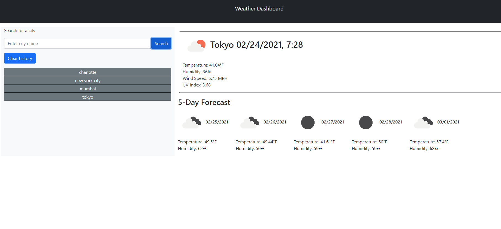
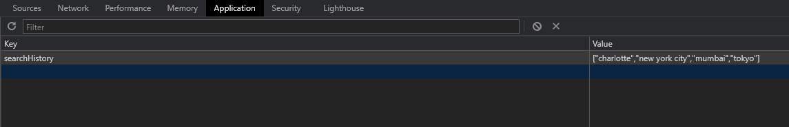

# Weather Dashboard App

The goal of this project was to create a simple browser application that fetches data from the openweathermap API and returns weather data for the city a user searches for.

The application also displays the future forecast for the next 5 days of the specified city. Past searched cities are saved to a list under the search bar. 

User searches are persisted through localstorage. List of saved cities persists if the user has used the app and revisits the site without clearing history. Note the 'Clear History' button will clear user local storage and clear the list contents. 

## Technologies used for this project 

- [OpenWeatherApi](https://openweathermap.org/api)
- [Bootstrap](https://getbootstrap.com/docs/5.0/getting-started/introduction/)
- [jQuery](https://jquery.com/)
- [moment.js](https://momentjs.com/)

## Installation and Usage 

Demo for this application is available at the deployed site hosted by github pages. [Link to Deployed Application.]()